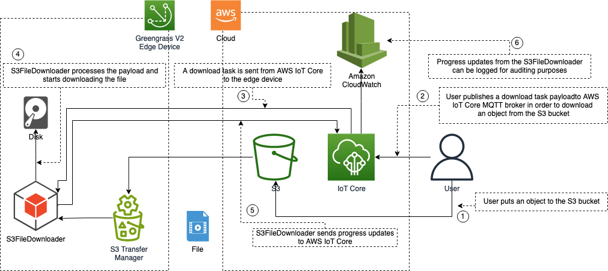

# aws-greengrass-labs-s3-file-downloader

This component downloads files from an Amazon S3 bucket by using Amazon S3 Transfer Manager. It has the following features: 
- Download orders are sent from AWS IoT Core to the edge devices
- Parallel download of multiple files
- Pause/resume downloads
- Write resume files to disk to continue from
- Send download progress to AWS IoT Core

This component specifically aims to address situations where downloading large files is necessary but network conditions are unreliable.



## Versions

This component has the following versions:

- 1.0.0

## Type

This component is a generic component. The Greengrass nucleus runs the component's lifecycle scripts.

For more information, see [component types](https://docs.aws.amazon.com/greengrass/v2/developerguide/develop-greengrass-components.html#component-types)

## Requirements

### Amazon S3 access

This component will download a file from an S3 Bucket to the local disk. You need to modify the Token Exchange Role that is used by Greengrass and give authorization to the S3 bucket that you want to use to download files from. See [Authorize core devices to interact with AWS services](https://docs.aws.amazon.com/greengrass/v2/developerguide/device-service-role.html) for the details. It is also possible to use the [artifacts bucket](https://docs.aws.amazon.com/greengrass/v2/developerguide/device-service-role.html#device-service-role-access-s3-bucket) that Greengrass already has permission to deploy components for this purpose.

## Dependencies
This component requires the following dependencies.

- Token Exchange Service >=2.0.3

## Build
Run the following command to build the component:
```
gdk component build
```
## Publish
Before publishing the component, you need to update the gdk-config.json file by replacing the bucket and region parameters.
``` json
      "publish": {
        "bucket": "<S3 BUCKET PREFIX>",
        "region": "<REGION>"
      }
```
gdk will use <s3-bucket-prefix>-<region>-<account-id> as the bucket name. If it doesn't exist, an S3 bucket will be created with this name. 

To be able to use this component in your devices, you need to publish it to AWS IoT Core.
```
gdk component publish
```

Go to [AWS IoT Core->Greengrass devices->Components](https://console.aws.amazon.com/iot/home#/greengrass/v2/components) in AWS console to check if the aws.greengrass.labs.S3FileDownloader component has been published successfully.

Now you can deploy the component by [creating a deployment](https://docs.aws.amazon.com/greengrass/v2/developerguide/manage-deployments.html) for your devices. 

When a Greengrass component is deployed, it uses ggc_user system user by default. It is possible to change the system user by [configuring the component](https://docs.aws.amazon.com/greengrass/v2/developerguide/update-component-configurations.html) during the deployment. You can set the system user parameter as a separate user in the Advanced configuration of the component. This is the recommended way of running the S3FileDownloader component, since the files written to the destination folder will only be accessed by this component or an authorized user. The user must be created in the operating system first in order to let the component to use this user.

## Configuration

This component has the following configuration:
- DOWNLOAD_TOPIC: MQTT topic which the component subscribes to receive download tasks
- PAUSE_TOPIC: MQTT topic to receive pause commands
- JOB_FEEDBACK_TOPIC: MQTT topic which the component publishes the download progress
- DESTINATION_FOLDER: the destination folder which the files are written

The topic structure uses [{iot:thingName} recipe variable](https://docs.aws.amazon.com/greengrass/v2/developerguide/update-component-configurations.html#merge-configuration-update-recipe-variables) in the following form `things/{iot:thingName}/+` , in order to send task to individual devices. 

To be able to use recipe variables, you need to set `interpolateComponentConfiguration` for Greengrass nucleus. You can find more information in the [Greengrass documentation](https://docs.aws.amazon.com/greengrass/v2/developerguide/update-component-configurations.html#merge-configuration-update-recipe-variables).

## Testing

### Subscribe to download progress

1. To view the download progress in AWS Console, go to [AWS IoT Core->MQTT Test Client](https://console.aws.amazon.com/iot/home#/test), then in the Subscribe to a topic tab, enter `things/<your-thing-name>/update` as the topic filter where `<your-thing-name>` is the name of the Greengrass core thing name and click Subscribe.

### Testing the download

2. Copy a file to an [S3 bucket](https://s3.console.aws.amazon.com/s3/home) which the Greengrass core has access. To test parallel file download, you can copy multiple files to the bucket.

3. In the [MQTT Test Client](https://console.aws.amazon.com/iot/home#/test), switch to Publish to a topic tab and fill it with the following information :

Topic name : ```things/<your-thing-name>/download```
``` json
{
    "s3Bucket": "<testbucket>",
    "key": "file.zip",
    "jobId": "filedownload"
}
```

4. You can view the download progress in the Subscription window of the MQTT Test Client.

### Multiple file download

5. To test parallel download function, you should have multiple files in the S3 bucket. You can publish the payload with different key and jobId. As in the following example:

Topic name : ```things/<your-thing-name>/download```
``` json
{
    "s3Bucket": "<testbucket>",
    "key": "file2.zip",
    "jobId": "filedownload2"
}
```

### Pause downloads

6. By using MQTT Test Client, publish any payload to ```things/<your-thing-name>/pause``` topic. This will pause all the downloads in the device. You can also view the pause feedback in the Subscription window of the MQTT Test Client.

### Resume a download

7. To resume a download process, publish the same payload to ```things/<your-thing-name>/download``` topic. The component will continue to download this particular file from where it was left.

Topic name : ```things/<your-thing-name>/download```
``` json
{
    "s3Bucket": "<testbucket>",
    "key": "file.zip",
    "jobId": "filedownload"
}
```
## Disk management

This component does not have any mechanism to prevent filling up the system disk due to large files. It is recommended to have a separate partition for the destination folder. By this way, the rest of the system will be protected from the failures due to limited disk space.
## Download status feedback

This component publishes the download progress updates to the device specific topic `things/<your-thing-name>/update`. For auditing purposes, you can forward these payloads to another service such as Amazon CloudWatch, in order to audit the historical download tasks of the devices.
## Logging

This component writes the logs to `<GreengrassInstallPath>/logs/aws.greengrass.labs.S3FileDownloader.log` file. It is also possible to [configure Greengrass](https://docs.aws.amazon.com/greengrass/v2/developerguide/monitor-logs.html#access-cloudwatch-logs) to send logs to Amazon CloudWatch.
## Changelog

The following table describes the changes in each version of the component.
| Version | Changes |
|---|---|
| 1.0.0 | Initial version |
## License

This project is licensed under the Apache-2.0 License.